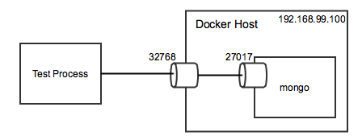

Examples
========

Testing a Web Application
-------------------------
This example explains how to test a `12 Factor`_ web application that
provides a simple web interface over a MongoDB server.  Configuration
values are injected into a 12 Factor application using environment
variables which dovetails nicely with how Docker linking works.  First
let's look at how the components are connected during a test run.

I modelled this case after my environment running on a MacBook.  The
*Docker Host* is provided using `docker-machine`_ which is a CoreOS
instance running in a virtual machine.  The docker host IP address
is ``192.168.99.100``.  If this were running natively on a Linux
system, then the docker host would likely be ``localhost``.

The MongoDB instance is running in a docker container.  It listens
on the well-known port for MongoDB -- 27017.  Docker exposes the
service port on an ephemeral port -- 32768 in this case.  Ephemeral
ports make it possible to run the same service in multiple containers.
Unfortunately, this makes testing difficult since both the application
under test and the test cases need to discover the ephemeral port on
the docker host.

`Docker compose`_ automates the linkage between multiple containers
running within a single host.  Docker provides linking via environment
variables and */etc/host* entries "out of the box" that docker compose
simply automates.  This library injects the same set of environment into
the test environment.  In this case, the following environment variables
will be injected into the running test process:

+--------------------------------+--------------------------------+
| ``MONGO_PORT_27017_TCP``       | ``tcp://192.168.99.100:27017`` |
+--------------------------------+--------------------------------+
| ``MONGO_PORT_27017_TCP_ADDR``  | ``192.168.99.100``             |
+--------------------------------+--------------------------------+
| ``MONGO_PORT_27017_TCP_PORT``  | ``27017``                      |
+--------------------------------+--------------------------------+
| ``MONGO_PORT_27017_TCP_PROTO`` | ``tcp``                        |
+--------------------------------+--------------------------------+

The web application *discovers* the IP address and port number for the
MongoDB service by looking at the :envvar:`MONGO_PORT_27017_TCP_ADDR`
and :envvar:`MONGO_PORT_27017_TCP_PORT` environment variables. In a
docker-based solution, these will be injected using docker linking.
In other environments, the environment variables can be injected via
other means such as a supervisord configuration file or Upstart script.

.. literalinclude:: ../examples/web.py
   :pyobject: make_application

The test suite uses :class:`dockertest.TestCase` which discovers the
docker host using standard configuration, interrogates the host using
the `docker api`_, and builds the process environment variable in the
same manner as docker linking would.  The test code itself looks rather
unimpressive:

.. literalinclude:: ../examples/test.py
   :pyobject: TestRootHandler

The only place that docker-style environment variables show up in the
test code is during the test fixture generation:

.. literalinclude:: ../examples/test.py
   :pyobject: Fixture.mongo_client

Handling Custom Configuration
-----------------------------
Docker-style environment variables are great if all that you need are
simple IP address and port numbers.  What if your application expects
URLs in the environment as well.  The :class:`dockertest.TestCase`
class includes the :meth:`~dockertest.TestCase.process_docker_service`
method for just this reason.  The default implementation injects the
environment variables for the test case.  You can implement custom
behavior by overriding or extending this method.

.. code-block:: python

   def process_docker_service(self, name, protocol, ip_address,
                              public_port, private_port):
      super(TestRootHandler, self).process_docker_service(
         name, protocol, ip_address, public_port, private_port)
      if name == 'mongo':
         os.environ['MONGOURL'] = 'mongodb://{0}:{1}/database'.format(
            ip_address, public_port)

.. _12 Factor: http://12factor.net/
.. _docker-machine: https://docs.docker.com/machine/
.. _docker compose: https://docs.docker.com/compose/
.. _docker api: https://docs.docker.com/reference/api/docker_remote_api/
